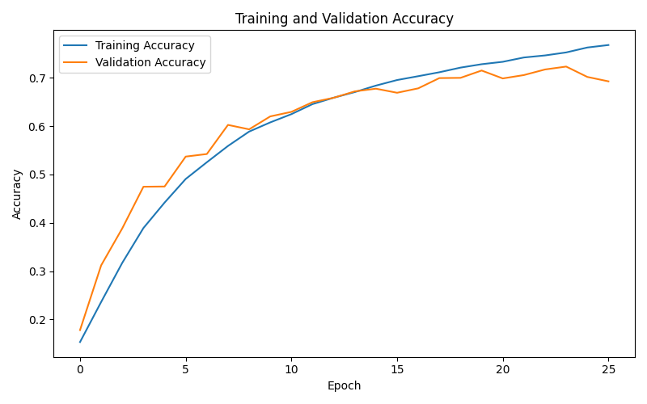
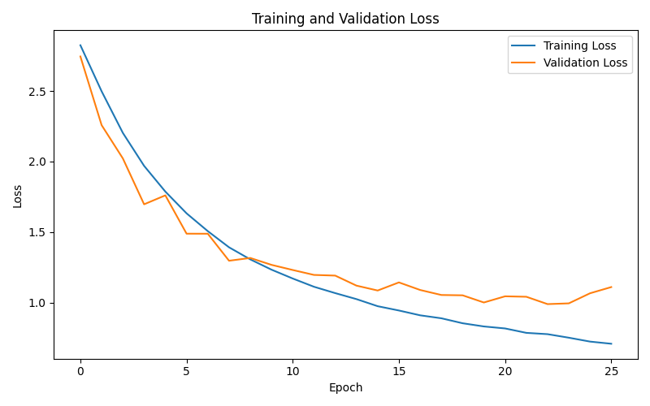

# Cleaning
The data in the dataset originally was organized purely by folders with no CSV or EXCEL file.
So the data was organized by **/make/model/generation/image#.jpg**.
<br><br>
Later in the project I also discovered that the dataset had 70 broken files that I had to find and remove.

#### Example:
```

\porsche\Porsche-911\porsche-911-gen-2013-2019\porsche-911-gen-2013-2019-1.jpg
```
I had to iterate over every make, then over every model, then over every generation, and finally over every image to assemble an array.
<br>
While doing so, I also had to fix some folder structures as some of the folders skipped the model entirely, so it would be /make/generation/image#.jpg. That I fixed manually.
<br>

# Splitting
For the split, as the sets of generations are very small, I have decided to leave more of the data for training, splitting it **80:10:10 for training, validation, and testing respectively**.
I **stratified the data by the generation** as that would by the structure of the data stratify it by makes and models as well.

# Training
### CPU vs GPU
I wanted to use GPU for training, so I had to use wls, as Tensorflow does not support GPU on Windows and newer versions of Python.
Moving to wsl was time-consuming as I was figuring things out as I go, and I had to move the whole project to linux as it was too inefficient to access the dataset from Windows.
But it allowed me to iterate quicker and use more epochs.

### First run
The first successful GPU run used a basic custom CNN trained from scratch.

Settings:

```ini
IMG_SIZE = (180, 180)
BATCH_SIZE = 32
EPOCHS = 3
Dropout = 0.3
Data_augmentation = None
```

Result:

```text
Test Accuracy: 42.93%
Test Loss: 1.8340
```

<hr>

### Second Run
Then I have tried to increase the number of epochs to 10.

```ini
BATCH_SIZE = 64
EPOCHS = 10
```

Result:
```text
Training Accuracy: 79.89%
Training Loss: 0.6021

Validation Accuracy: 60.66%
Validation Loss: 1.6670

Test Accuracy: 56.88%
Test Loss: 1.4750
```

The large gap between training and validation accuracy showed that it was overfitting.
<br>So I added augmentation and increased the dropout to 0.5, but it did not help much.

<hr>

#### Third Run

```ini
Dropout = 0.5
Data_augmentation = RandomFlip, RandomZoom(0.1), RandomRotation(0.05)
```

Result:
```text
Training Accuracy:   42.36%
Training Loss:       1.8513

Validation Accuracy: 54.49%
Validation Loss:     1.4868

Test Accuracy:       53.94%
Test Loss:           1.4933
```
The high dropout and augmentation resulted in underfitting, so I have reduced the dropout to 0.3 and the augmentation to a smaller degree.

<hr>

#### Fourth Run
```ini
Dropout = 0.3
Data augmentation = RandomFlip, RandomZoom(0.05), RandomRotation(0.02)
```

Result:
```text
Training Accuracy:   55.06%
Training Loss:       1.4139

Validation Accuracy: 59.58%
Validation Loss:     1.3187

Test Accuracy:       58.37%
Test Loss:           1.3474
```
That helped. But now I wanted to see what would happen if I increased the image resolution.

#### Fifth Run
```ini
IMG_SIZE = (224, 224)
```

Result:
```text
Training Accuracy:   60.77%
Training Loss:       1.2416

Validation Accuracy: 61.24%
Validation Loss:     1.2851

Test Accuracy:       62.56%
Test Loss:           1.2605
```

Increasing the image size improved the model’s performance, most likely because the CNN could see more details in each image, like car grille, headlights, body shape, and so on.

<hr>
#### Final Run
For the final run, I kept the best setup and increased the maximum number of epochs while using early stopping.

```ini
IMG_SIZE = (224, 224)
BATCH_SIZE = 64
EPOCHS = 30
Dropout = 0.3
Data augmentation = RandomFlip, RandomZoom(0.05), RandomRotation(0.02)
Early stopping = enabled
```
Result:
```ini
Training Accuracy:   76.78%
Training Loss:       0.7102

Validation Accuracy: 69.26%
Validation Loss:     1.1115

Test Accuracy:       70.66%
Test Loss:           1.0446
```

This was the best result I got. While not perfect, it is still a decent result given 24 car brands and the variety in models and generations. 
<br><br>
I achieved the final test accuracy of 70.66%. For perspective, there is only a 4.17% chance of randomly guessing one out of 24 brands used.



